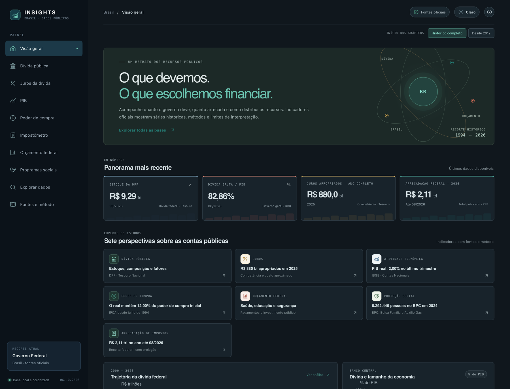
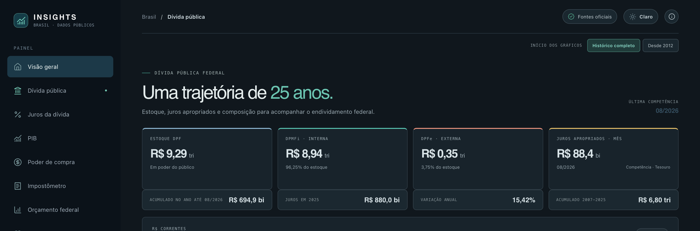
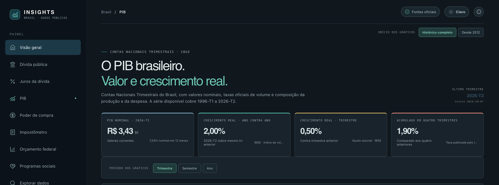

# Insights Brasil

**Dados públicos para entender as contas, as políticas e a economia do Brasil.**

<p align="center">
  <a href="https://certainlywrong.github.io/insights/">
    
  </a>
</p>

Um projeto de pesquisa que reúne fontes oficiais, séries históricas, notebooks reproduzíveis e um painel interativo. O foco principal é a **dívida pública brasileira**, com estudos complementares sobre gastos, PIB, impostos, programas sociais e poder de compra.

<p align="center">
  
</p>
<p align="center"><em>Visão geral — indicadores e estudos reunidos no painel.</em></p>

<p align="center">
  
  
</p>
<p align="center"><em>Dívida pública e PIB — cada página apresenta métricas, séries e explicações de método.</em></p>

O painel funciona diretamente no navegador e carrega os dados incluídos no projeto, sem consultar APIs externas durante o uso. Para executar localmente ou preparar dados atualizados, use o inicializador abaixo.

## Execute localmente

Requisitos: [uv](https://docs.astral.sh/uv/) e Node.js com npm.

```sh
./start.sh
```

O inicializador prepara as dependências, atualiza os dados locais do painel e abre o site em <http://127.0.0.1:5173>. Encerre com `Ctrl+C`.

## O que você encontra

- **Dívida pública:** estoque da DPF, juros apropriados, fatores de variação, emissões, resgates e composição; inclui contexto da DBGG/PIB.
- **Gastos públicos:** execução federal paga em saúde, segurança pública e educação, com destaque para investimentos GND 4.
- **Programas sociais:** histórico agregado do BPC e contexto de Bolsa Família e Auxílio Gás.
- **PIB:** valores nominais e crescimento real das Contas Nacionais Trimestrais do IBGE.
- **Impostos:** arrecadação federal mensal e carga tributária anual do Governo Geral.
- **Inflação dos alimentos:** IPCA de alimentos e bebidas, comparação com o índice geral, subitens, sazonalidade e áreas pesquisadas.
- **Poder de compra:** variação dos preços pelo IPCA desde julho de 1994.

Os gráficos do site têm explicações sobre o que medem, como interpretar os resultados, por que importam e o que estudar para aprofundar a análise.

## Organização do projeto

```text
src/insights/     CLI, catálogo de fontes, coleta e armazenamento DuckDB
data/raw/         arquivos preservados das fontes oficiais
data/processed/   tabelas normalizadas para análises e painel
notebooks/        estudos reproduzíveis em Jupyter
scripts/          processamento, apresentação em PDF e empacotamento
web/              painel Vue 3 + Vite e compilador do bundle de dados
artifacts/        PDF de apresentação e ZIP distribuível
.insights/        banco DuckDB e coletas da CLI (criados durante o uso)
```

O estudo visual que reúne gráficos do painel e explicações está em [notebooks/estudo_graficos_politicas_publicas.ipynb](notebooks/estudo_graficos_politicas_publicas.ipynb). Cobertura, fontes, fórmulas e limitações estão descritas em [data/README.md](data/README.md).

## Atualize dados e análises

As atualizações são manuais. Exemplo de fluxo para obter dados e reconstruir o painel:

```sh
uv run python scripts/processar_divida.py
uv run python scripts/baixar_investimentos_areas.py
uv run python scripts/baixar_pib.py
uv run python scripts/processar_impostos.py
uv run python web/scripts/build_data.py
```

Abra os notebooks com `uv run jupyter lab`. Atalhos para tarefas comuns:

```sh
make build    # prepara dados e compila o site
make pdf      # gera a apresentação em PDF
make package  # gera o PDF e o ZIP do projeto
```

## Catálogo e banco local

A CLI lista fontes, coleta conjuntos e consulta o estado do banco DuckDB:

```sh
uv run insights catalog
uv run insights fetch pncp_contratacoes --max-pages 2
uv run insights update pncp_contratacoes --max-pages 5
uv run insights status
```

O banco fica em `.insights/insights.duckdb` e os arquivos brutos da CLI em `.insights/raw/`. Defina `INSIGHTS_HOME` para escolher outro diretório. Conjuntos da CGU que exigem autenticação usam `PORTAL_TRANSPARENCIA_TOKEN`, lido do ambiente. A documentação da interface web está em [web/README.md](web/README.md).

## PDF e pacote do projeto

```sh
make pdf      # artifacts/apresentacao_insights_brasil.pdf
make package  # artifacts/insights-brasil-projeto.zip
```

O PDF é gerado a partir de um notebook de apresentação, com gráficos e explicações sem células de código. O ZIP inclui o projeto e o PDF, sem `.venv`, `.git`, `node_modules`, arquivos compilados ou caches; as dependências podem ser recriadas com `uv sync` e `npm ci --prefix web`.

## Publicar no GitHub Pages

O workflow `.github/workflows/deploy-pages.yml` compila e publica o site automaticamente quando há mudanças em `web/` na branch `main`. Também pode ser iniciado manualmente na aba **Actions**. Para atualizar os dados publicados, regenere o bundle com `uv run python web/scripts/build_data.py` e inclua as alterações em `web/` no commit; o workflow fará uma nova publicação.

Cada estudo tem um endereço direto, por exemplo <https://certainlywrong.github.io/insights/divida-publica> e <https://certainlywrong.github.io/insights/pib>. A navegação entre dívida, juros, PIB, poder de compra, impostos, orçamento, programas sociais, explorador e fontes também é feita pelo menu do painel.
